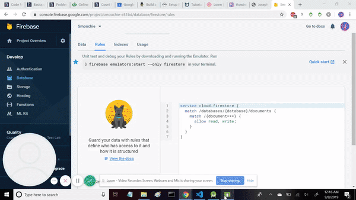

# Command Line Dating App
  This android app allows users to view other user accounts made in the same zipcode and like them. If another user likes them back, the matched user's profile information will be added to the original user's match list, where contact information then becomes available so the users can contact one another outside of the app.
  
 This app was built with **Java** in **Android Studio** and using **Google's NOSQL firebase Database** to fetch by zipcode, store profile, match, and like information.
 

